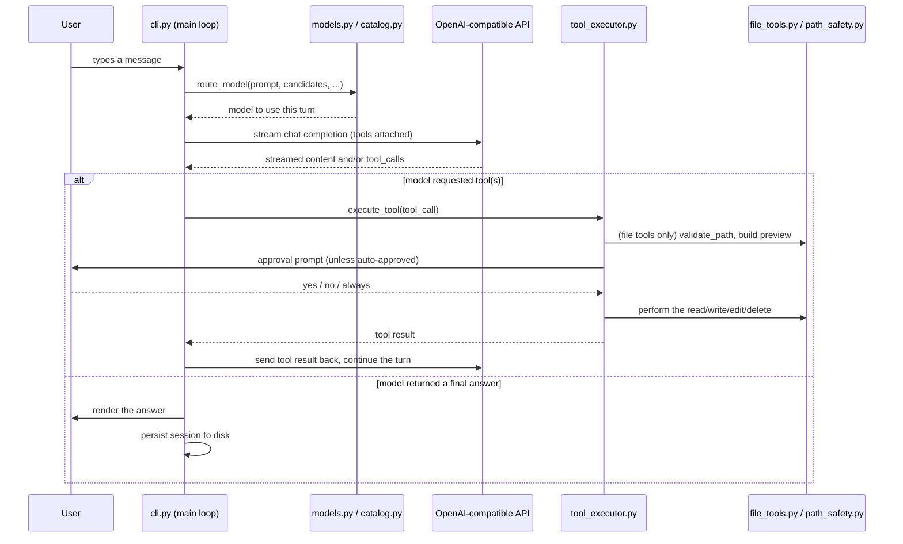

# TermiCode Architecture

This document describes how TermiCode is put together: the module map, the lifecycle of a single turn, and where the boundaries between subsystems are. It describes the codebase as it exists today — it is not a proposal for how the codebase should change.

For depth on specific subsystems, see the [`docs/`](docs/) folder, linked throughout.

## What TermiCode is, structurally

TermiCode is a single-process, interactive terminal application. There is no server, no client/server split, and no background daemon. Running `termicode` starts one Python process that:

1. Validates the environment and connects to an OpenAI-compatible API (OpenRouter by default).
2. Loads or creates a conversation.
3. Runs a read-eval-print loop: read a line of input, act on it (a slash command or a message to the model), print the result, repeat.
4. Persists the conversation to disk on every turn and on exit.

Everything else in the codebase exists in service of that loop.

## Module map

| Module | Responsibility |
|---|---|
| `cli.py` | Orchestration. Owns the REPL loop, slash-command dispatch, the per-turn model-routing call, the streaming/fallback call, and turn-level state (`current_model`, `session_tokens`, message history). This is the only module that ties the others together — it is intentionally the largest file and the one most other modules are unaware of. |
| `ui.py` | All terminal presentation (Rich panels, prompts, colors). Pure rendering — it never decides *whether* to show something, only *how*. Approval prompts (`print_security_alert`, `print_command_alert`) are the one place `ui.py` returns a value the caller acts on. |
| `tool_executor.py` | Dispatches a model-issued tool call to the corresponding Python function, and owns the approval policy (`ApprovalState`, the `_confirm` gate) for file-mutating tools. See [docs/tool-system.md](docs/tool-system.md) and [docs/approval-flow.md](docs/approval-flow.md). |
| `tools.py` | A stable, flat import surface (`from termicode import tools`) re-exporting functions from `file_tools.py`, `command_tools.py`, `search_tools.py`, `health_tools.py`, `doctor.py`, `report.py`, `rules.py`, `path_safety.py`. Exists so the rest of the codebase (and `tool_executor.py` in particular) has one place to import tool implementations from, regardless of which file actually defines them. |
| `file_tools.py` | Reading, writing, surgically editing, backing up, restoring, and deleting files; listing and creating directories. |
| `command_tools.py` | Running an arbitrary shell command with a timeout (`run_command_approved`). |
| `search_tools.py` | Exact-string codebase search (gitignore-aware) and live web search. |
| `path_safety.py` | The sandbox boundary. `validate_path` resolves a requested path against the real (symlink-resolved) working directory and refuses anything outside it; `_is_protected` blocks secrets and session-state files by name/pattern. Every file-touching tool calls into this before touching disk. |
| `diff.py` | Builds the human-readable preview (unified diff, or a new-file/delete summary) shown before a file mutation is approved. Refuses protected paths itself, independently of `tool_executor.py`'s own check — see [docs/approval-flow.md](docs/approval-flow.md). |
| `ignore.py` | `.gitignore`-aware directory/file skipping, shared by directory listing and codebase search. |
| `prompts.py` | Builds the system prompt and the tool schema (`get_available_tools`) offered to the model. Both are gated on whether Repowise is available, so the model is never told about a tool it cannot actually call. |
| `models.py` | The routing *policy* layer: `route_model` (pick a model for this turn), `next_fallback_model` (pick the next untried candidate after a rate limit), `get_token_usage` (price a turn from the live catalog). Deliberately thin — see [docs/model-routing.md](docs/model-routing.md). |
| `catalog.py` | The routing *data* layer: fetches, caches, and scores OpenRouter's live model list. `models.py` and `cli.py` consume this; nothing in `catalog.py` talks to a chat-completions endpoint. See [docs/model-routing.md](docs/model-routing.md). |
| `session.py` | Where conversation history and the rolling memory summary live on disk (`~/.termicode/`), migration from the old in-project location, and context pruning/summarization. See [docs/sessions.md](docs/sessions.md). |
| `startup.py` | Preflight: validates `OPENROUTER_API_KEY`, constructs the API client, pings it once, and detects Repowise. |
| `repowise.py` | Detection and invocation helpers for the optional Repowise integration (`/heal`, `/report`, `/guard`, the `get_health`/`get_overview`/`get_context` tools). Cached per process. |
| `doctor.py` | `/doctor`'s local-environment checks (Python version, API key present, git repo, Repowise, dependencies, workspace writability). |
| `report.py` | Builds the Markdown report `/report` writes to `.termicode_reports/`. |
| `rules.py` | Generates `AGENT.md` (project-specific rules the system prompt reads back in) based on detected project type. |
| `project.py` | Builds the project file-tree map shown at startup and by `/map`. |
| `guard_check.py` | A separate entry point (`termicode-guard-check`), installed as its own console script and invoked by the git pre-commit hook `/guard on` writes. Runs outside the main TermiCode process — see [docs/tool-system.md](docs/tool-system.md#guard_check-a-separate-process). |

## Request flow: the life of one turn

Key points this diagram doesn't show, and where to read about them:

- **Model selection and the 429 fallback chain both draw from the same live candidate list**, fetched once per turn — [docs/model-routing.md](docs/model-routing.md).
- **Streamed tool calls are accumulated by index, not by id** — a provider only sends a tool call's id and name once, on its first chunk — [docs/tool-system.md](docs/tool-system.md).
- **The approval gate is per-tool-type, not global**: file writes/edits/deletes can be auto-approved for the rest of the session; `run_command` never is — [docs/approval-flow.md](docs/approval-flow.md).
- **Interrupting a turn (Ctrl+C) mid-tool-call** requires repairing the message history before the next request can succeed — every `tool_calls` entry on an assistant message must have a matching `tool` result, or the API rejects the next request outright. `cli.py`'s `_close_unanswered_tool_calls` does this repair.
- **Session persistence happens on every completed turn, on interrupt, and on exit** — not just at shutdown — see [docs/sessions.md](docs/sessions.md).

## Known constraints (descriptive, not a to-do list)

- **Tool dispatch is an explicit `if/elif` chain** in `tool_executor.py`, paired with a matching schema entry in `prompts.py`. There is no tool-registration mechanism or plugin system; adding a tool means editing both files. See [docs/tool-system.md](docs/tool-system.md) for the exact steps.
- **Provider is hardcoded to OpenRouter's OpenAI-compatible endpoint** (`startup.py`). There is no provider-abstraction layer; switching to a different provider means changing `base_url`/`api_key` construction directly.
- **`guard_check.py` runs as a separate process**, invoked by git as a pre-commit hook, not as part of the main TermiCode REPL. It imports from the `termicode` package but shares no runtime state with a running TermiCode session.

## Tests

154 tests as of this writing, under `tests/`, one file per subsystem roughly mirroring the module map above (e.g. `test_catalog.py` for `catalog.py`, `test_path_safety_escape.py` for the sandbox boundary). `tests/conftest.py` redirects the process's temp directory to `<repo>/.tmp` for the whole test run and adds the repo root to `sys.path`. See [CONTRIBUTING.md](CONTRIBUTING.md) for how to run them.
